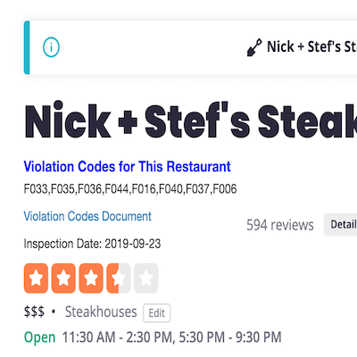

# Chrome Extension, Grub or Grubby?

### About
While chatting about the results of some data analysis projects exploring the Los Angeles, California restaurant scene, we (<a href='https://github.com/sherirosalia'><strong>Sheri </strong></a> and <a href='https://github.com/yanamal'><strong>Yana</strong></a> ) found inspiration for this project which calls the Los Angeles City API and displays resulting restaurant violation information on a Yelp restaurant review page.

### Screencast of how the extension works:
Click on this <a href='https://sherirosalia.github.io/Stars-of-LA'><strong>link </strong></a>to see deployment. 

### Frameworks
 Javascript
 API
 
### File Structure
#### root
- readme and the following folders:
#### docs
- Inside of the docs folder are the html and css files along with the images in a directory needed to showcase deployment.

#### extension
- JavaScript files to create the Google Chrome Browser Extension.

### Related repositories:
- <a href="https://github.com/sherirosalia/LA_Restaurants_Yelp_API">LA Restaurants Yelp API</a>
- <a href="https://github.com/sherirosalia/Dirty_Rats_Machine_Learning">Dirty Rats Machine Learning</a>
- <a href="https://github.com/sherirosalia/Stars-of-LA">Stars of LA</a>
- <a href="https://github.com/sherirosalia/data_rats">Data Girls</a>

### Restaurant violations display 

